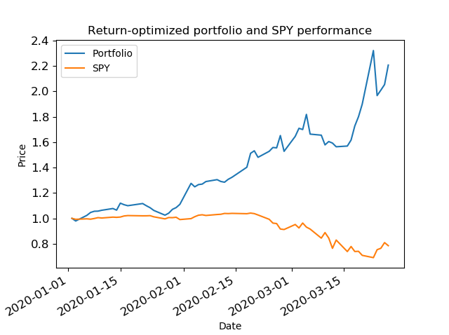
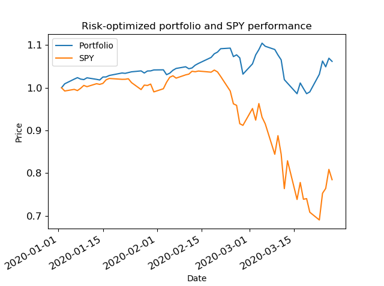
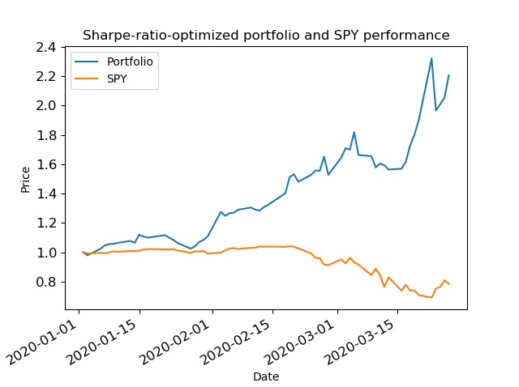

# Project 3

A function that returns optimized portfolio allocations over a certain time period with respect to each of the following criteria:
- Cumulative return
- Risk
- Sharpe ratio

### Results

The function was tested for each criteria over the time period 1/1/2020 to 3/30/2020 with a portfolio of `GOOG, AAPL, GLD, ZM, COST, UAL` (allocations follow respectively).

When optimized for cumulative return, allocations were `(0, 0, 0, 1, 0, 0)`. 

When optimized for risk, allocations were `(0.0667, 0, 0.7594, 0.0280, 0.1458, 0)`.

When optimized for Sharpe ratio, allocations were `(0, 0, 0, 1, 0, 0)`.

